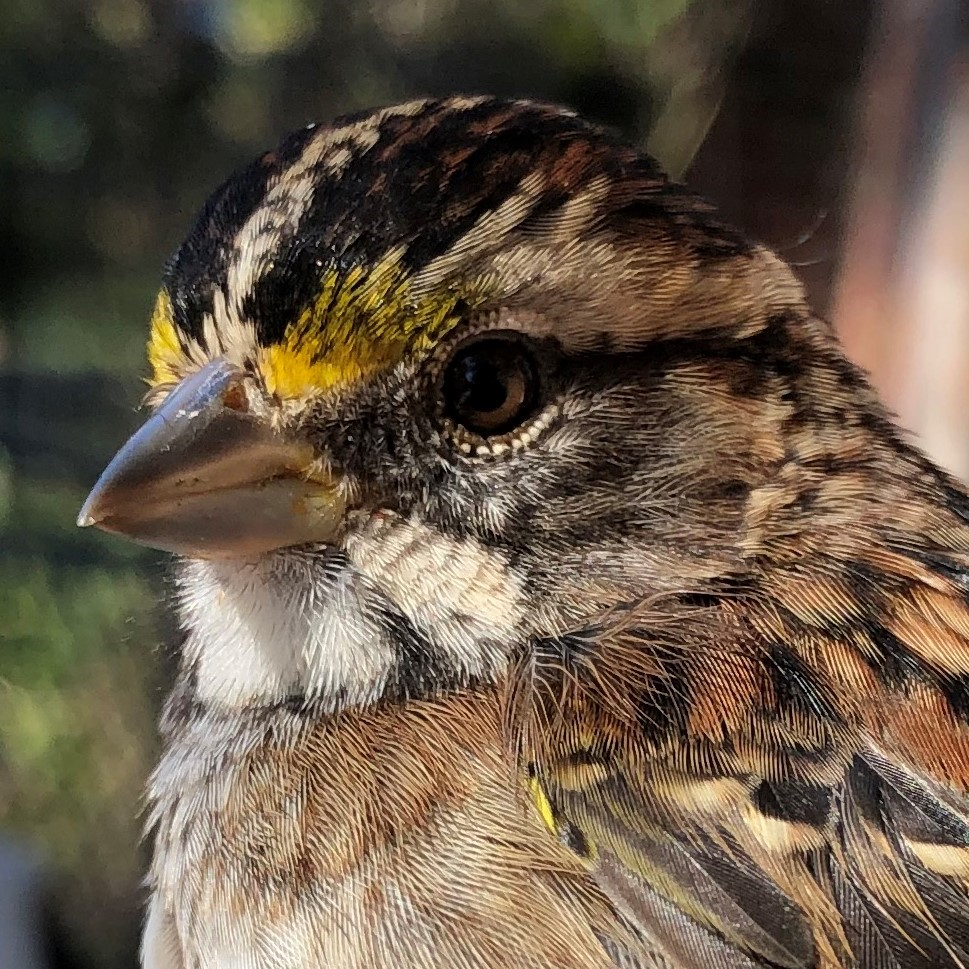
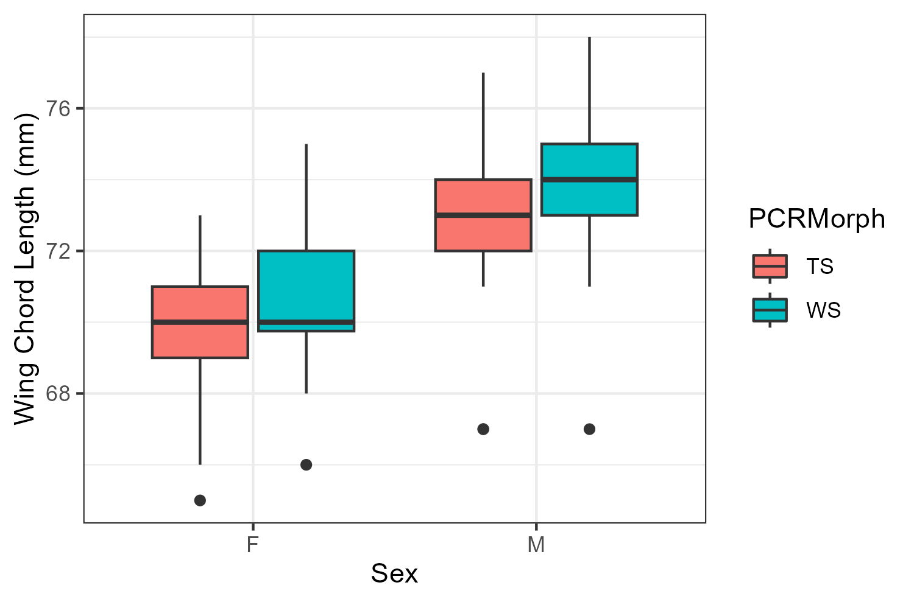
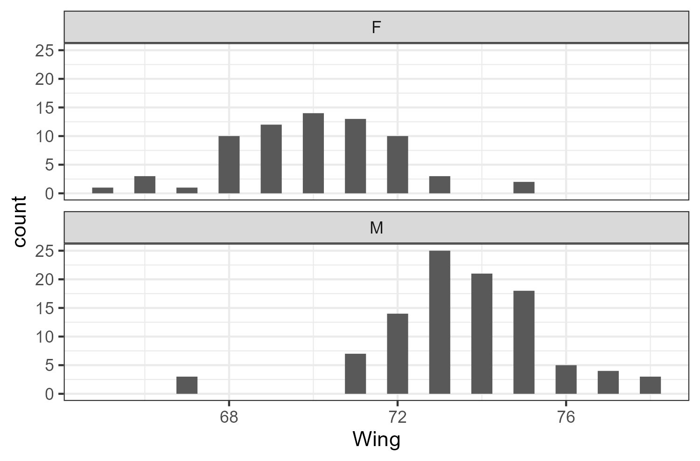

```{r setup, include=FALSE}
knitr::opts_chunk$set(fig.asp = .66, fig.width = 5)
#Its common to have a setup area to help keep track of required packages and formatting options

library(tidyverse)  #importing, tidying, plotting data
library(knitr)      #making tables
library(leaflet)
library(dplyr)
library(hexbin)
library(ggplot2)
library(readr)
library(RColorBrewer)
library(ggfortify)
library(emmeans)
library(multcomp)
library(multcompView)
library(tidyr)
library(gridExtra)

#knitr::opts_chunk$set(fig.width = 5, fig.asp = 1/3) #force figures to be a certain size and aspect ratio
#opts_chunk$set(echo=FALSE)   #can force hide all code in the output; disables 'code folding'
```

# White-Throated Sparrows

White-throated Sparrows are a polymorphic species which come in a white-stripe morph and a tan-stripe morph. Plumage is not sexually dimorphic and both males and females can have either the white or tan morph plumage. White-throated Sparrow mate disassortitavely by morph so that a white morph always pairs with a tan morph creating two pairing possibilities and four functional sexes. More information on White-throated Sparrows can be found [here](https://www.allaboutbirds.org/guide/White-throated_Sparrow/overview).

```{r wtsp morphs, echo=FALSE, fig.show = "hold", out.width = "50%", fig.align = "default", fig.cap="Figure 1.Presumed white morph (left) and tan morph (right) White-throated Sparrows"}
## echo=FALSE ensures that the code does not show in the final knit product
## out.width is for width of the figures, fig.align default places them next to eachother
## fig.cap adds a caption to the figure

knitr::include_graphics("images/White_morph.png") ## To include the first figure
 ## To include the second figure


```

# Study Sites

The study sites where White-throated Sparrows were banded and data collected are Eastern Hills and Emerald Hill in Clarksville, TN. Both consist of small fragments of deciduous woodland imbedded within an urban landscape, suitable habitat for White-throated Sparrows.

```{r Map, echo=FALSE, fig.align='left', fig.cap="Figure 2. A map including the study sites of Eastern Hills and Emerald Hill within Clarksville, TN"}
leaflet() %>%
  setView(-87.333504, 36.528784, zoom = 13) %>% #lat-long of the place of interest
  addTiles() %>%
  addMarkers(-87.318328, 36.517943, popup = "Eastern Hills") %>%
  addMarkers(-87.360390, 36.539128, popup = "Emerald Hill") ## Added markers for eastern and emerald hill
  
```

# Sex Differences and Morph Differences

Even though plumage is not sexually dimorphic in White-throated Sparrows, there may be other differences by sex. Male White-throated Sparrows generally winter further north than female White-throated Sparrows. As such, there may be differences in wing morphology. Morph may also affect development, so differences could be seen between morphs.

```{r wing length sex morph plot, echo=FALSE, message=FALSE, fig.show="hold", out.width = "50%", warning=FALSE, fig.align = "horizontal", fig.cap="Figure 3. Wing chord length broken down by sex (left) and both sex and morph (right)."}

wing <- read.csv("data/wtsp_data.csv") #load in dataset
feather_clean <- wing %>%
  filter(PCRsex != "") %>%
  filter(PCRsex != "X") %>%
  filter(PCRMorph != "") %>%
  filter(Wing != "")

## Needed to clean up the data. Removed all instances of blank or undesired characters in the dataset 

wing_violin <- ggplot(feather_clean, aes(x = PCRsex, y = Wing)) +
  geom_violin(fill='#A4A4A4')+
  geom_boxplot(width=0.1) + theme_minimal() +
  xlab("Sex")+
  ylab("Wing Chord Length (mm)")+
  theme_bw()+
  theme(legend.position="none")

##creating a violin plotas an object

ggsave("output/wing_violin.png") ##saving the plot

wing_boxplot <- ggplot(feather_clean, aes(x = PCRsex, y = Wing, fill = PCRMorph)) +
  geom_boxplot() +
  theme_bw() +
  xlab("Sex")+
  ylab("Wing Chord Length (mm)")

ggsave("output/wing_box.png")

knitr::include_graphics("output/Wing_violin.png") ## To include the first figure
 ## To include the second figure
```

# Analysis

A t-test would be used if sex were the only categorical variable. To test whether both sex and morph affect wing chord length, we will use a two-way ANOVA.

```{r Wing Chord Length Summary, echo=FALSE, warning=FALSE, message=FALSE}

sum_table_sex <- summarise(group_by(feather_clean,PCRsex),
          n=n(), 
          mean=mean(Wing),
          sd=sd(Wing))  
kable(sum_table_sex, caption = 'Table 1. Mean wing chord length (mm) and standard deviation for male and female White-throated Sparrows', digits = c(0, 0, 1, 1))

sum_table_sex <- summarise(group_by(feather_clean,PCRsex,PCRMorph),
          n=n(), 
          mean=mean(Wing),
          sd=sd(Wing))  
kable(sum_table_sex, caption = 'Table 2. Mean wing chord length (mm) and standard deviation for male and female white and tan morph White-throated Sparrows', digits = c(0, 0, 1, 1))
  
```

## *Wing Chord Length and Sex*

Data looks to be normally distributed, so a Welch's t-test was utilized. Mean wing chord length for female White-throated Sparrows (70.0mm) was significantly different (t = -11.5, df = 147.6, p < 0.001) from mean wing chord length for male White-throated Sparrows (73.57).

```{r Wing chord t-testl, echo=FALSE, message=FALSE, error=FALSE, out.width = "50%", fig.align='center', fig.cap="Figure 4. Histogram showing distribution of wing chord length for male and female White-throated Sparrows"}
feather_clean$Wing <- as.numeric(feather_clean$Wing) #Make sure as number
feather_clean$PCRsex <-  as.factor(feather_clean$PCRsex) #Make sure as factor
feather_clean$PCRMorph <- as.factor(feather_clean$PCRMorph)

# Make a histogram to check normality, looks close enough
sex_histogram <- ggplot(feather_clean, aes(x = Wing)) +
  geom_histogram(binwidth = .5) +
  facet_wrap(~ PCRsex, ncol = 1) +
  theme_bw()

ggsave("output/sex_histogram.png") ##saving the plot
# ## To include the figure

t.test(Wing ~ PCRsex, data = feather_clean)

```
## *Wing Chord Length, Sex, and Morph*

Wing chord length differed significantly for both sex (df = 1, F = 28.3 ,p < 0.001) and morph (df = 1, F = 125, p < 0.001) in White-throated Sparrows. Males had a longer wing chord length than females, and white morphs had a longer wing chord length than tan morphs. There were no interactions. 
```{r wing chord two-way anova, echo=FALSE, message=FALSE, error=FALSE, warning=FALSE, out.width = "50%", fig.align='center', fig.cap="Figure 5. Plots checking assumptions for wing chord length model"}
#fit model with interaction
model_wing <- lm(Wing ~ PCRMorph * PCRsex, data = feather_clean)
#examine model
wing_assumption <- autoplot(model_wing, smooth.colour = NA)
#wing_assumption

anova(model_wing)

summary(model_wing)
```
# Videos

<iframe src="https://macaulaylibrary.org/asset/476174/embed" height="362" width="320" frameborder="0" allowfullscreen>

</iframe>

<iframe src="https://macaulaylibrary.org/asset/469146/embed" height="362" width="320" frameborder="0" allowfullscreen>

</iframe>
